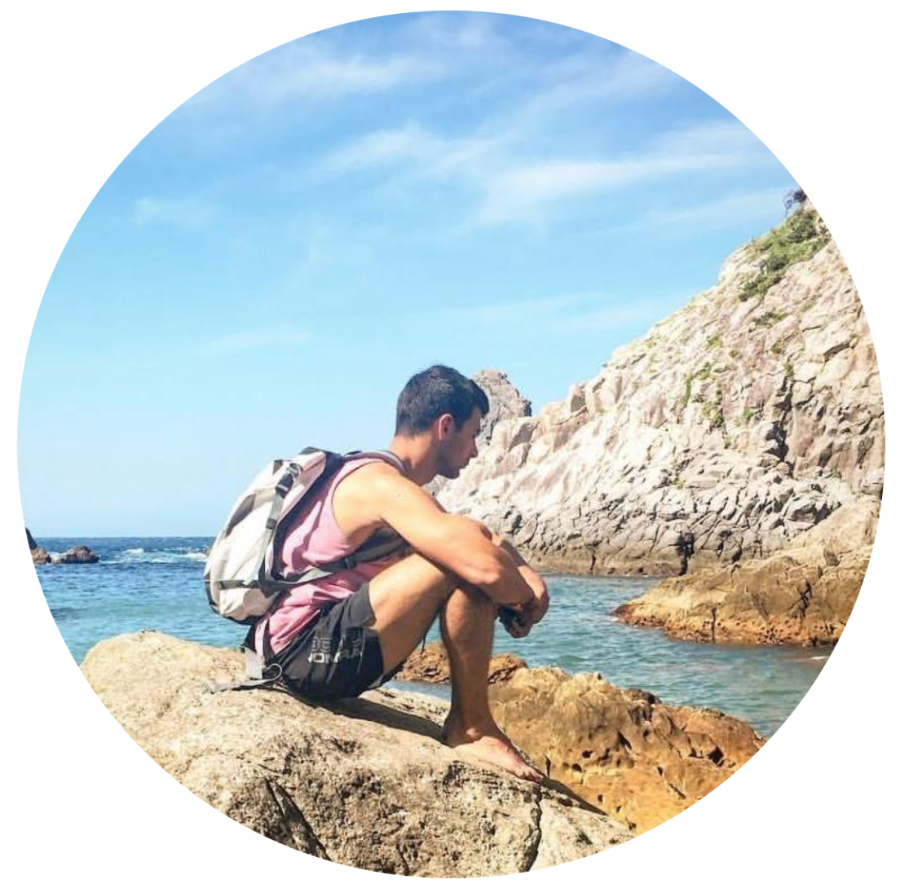

&nbsp;

&nbsp;

I am currently a Postdoctoral Researcher in [Dr. Michael Cunliffe's](https://www.mba.ac.uk/fellows/cunliffe-group) laboratory at the Marine Biological Association of the United Kingdom, investigating the significance of planktonic marine fungi in the global carbon cycle. I completed my PhD at the University of Otago Department of Botany in 2019, supervised by [Dr. Linn Hoffmann](https://www.researchgate.net/profile/Linn_Hoffmann) and [Dr. Tina Summerfield](https://www.researchgate.net/profile/Tina_Summerfield), and an M.Res. in marine biology at Plymouth University and the Marine Biological Association supervised by [Prof. Jason Hall-Spencer](https://www.researchgate.net/profile/Jason_Hall-Spencer) and [Dr. Andy Foggo](https://www.researchgate.net/profile/Andrew_Foggo). My research interests centre around the fundamental ecological dynamics of the microbial communities, whilst my PhD thesis focussed on the use of high-throughput sequencing to investigate the community level responses of marine protists and bacteria to climate change.   

<a href="roalle@mba.ac.uk" class="btn btn-default" style="float: right;">Contact</a>

<a class="twitter-timeline"
   href="https://twitter.com/rojallen"
   data-width="300"
   data-height="300"
   data-chrome="nofooter noscrollbar noborders transparent"
   data-theme="dark"
   data-tweet-limit="1">Tweets by @rojallen</a>
