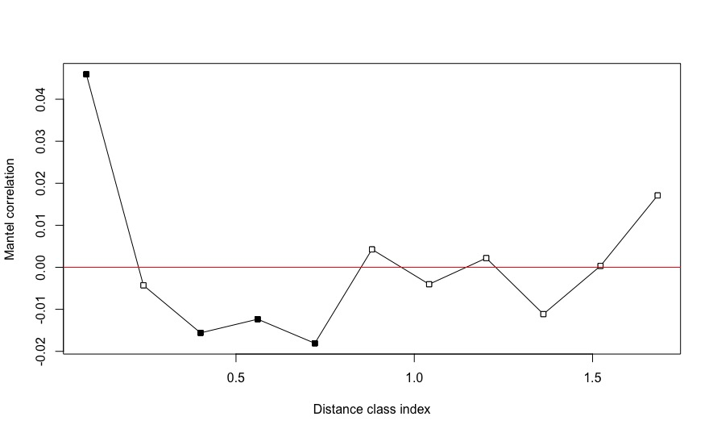
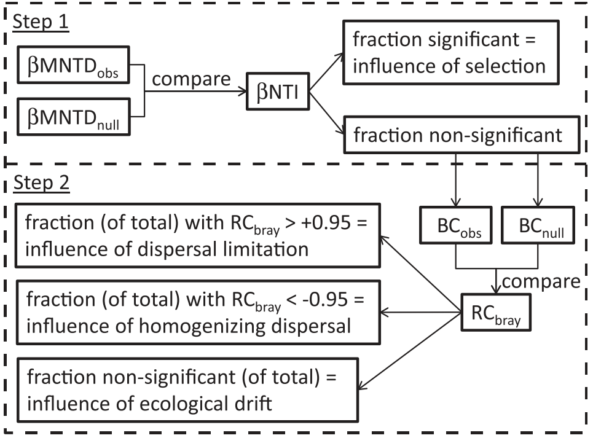

Microbial community assembly processes in the South Pacific Gyre were resolved using a null-model approach described in [Stegen et al. (2013)](https://www.nature.com/articles/ismej201393). A fundamental assumption of the approach is that microbes which are more phylogenetically similar also occupy more similar ecological niches. This assumption can be empirically tested first by generating two distance matrices. The first, of phylogenetic similarity between each pair of amplicon sequence variants (ASVs) based on 16S rRNA gene sequences, and the second, of ecological niche similarity between each pair of ASVs based on weighted occurence values. These two distance matrices are then used to generate a mantel correlogram (Fig. 1) which illustrates the correlation between the two matrices at varying levels of phylogenetic similarity. 

Figure 1 shows that significant positive correlation between phylogenetic similarity and ecological niche similarity is constrained to only very closely related ASVs. This is accounted for by using the $\beta$-mean nearest taxon distance meaure to quantify phylogenetic turnover between communities. 

**Fig. 1** Mantel correlogram of the relationship between phylogenetic distance and ecological niche distance in microbial communities in the South Pacific Gyre. Ecological niche was calculated taking into account all measured environmental variables. 

&nbsp;

Below, I briefly introduce the measures reported in the poster, and the overall workflow used to resolve microbial communtiy assembly processes:

**$\beta$-mean nearest taxon distance ($\beta$MNTD)** is a measure of phylogenetic turnover between communities. The metric quantifies the phylogenetic distance between each ASV in community A, and its closest relative in community B, generating an abundance-weighted mean value for each pair of communities.  

  
**$\beta$-nearest taxon index ($\beta$NTI)** is a measure of the relationship between observed $\beta$MNTD and the distribution of $\beta$MNTD values expected under a null model distribution (simulating neutral community assembly). The measure is expressed as standard deviation according to the null model distribution. $\beta$MNTD values > +2 show greater phylogenetic turnover than expected, indicating that *variable selection* is the dominant microbial community assembly process. In contrast, values < -2 show less phylogenetic turnover than expected, indicating that *homogenising selection* is the dominant microbial community assembly process. pairs of communities with non significant $\beta$NTI values (> |2|) are further analyses using the RCbray measure described below.

**Raup-Crickbray (RCbray)** is a measure of the relationship between observed bray-curtis dissimilarity and the distribution of bray-curtis dissimilarity values expected under a null model. The metric is superificially similar to $\beta$NTI, but does not take phylogenetic information into account, and can subsequently be used to resolve stochastic community assembly processes. RCbray values > +0.95 show that there is greater ASV turnover between communities than expected under the null model, indicating that *dispersal limitation* is the dominant community assembly process. RCbray values < =0.95 show that there is less ASV turnover between communities than expected under the null model, indicating that *homogenising dispersal* is the dominant community assembly process. RCbray values < |0.95| represent the undominated community assembly scenario described in [Stegen et al. (2015)](https://www.frontiersin.org/articles/10.3389/fmicb.2015.00370/full).   

For further information of the measures described above, see [Stegen et al. (2013)](https://www.nature.com/articles/ismej201393).   

The analyses are implemented according to the workflow shown in Figure 2, where observed and null model distribution $\beta$MNTD values are calculated for each pair of communities. From these values, $\beta$NTI is calculated. If pairs communities display non-significant $\beta$NTI values, they are subjected to RCbray analysis to partition stochastic community assembly processes.   

    
**Fig. 2** From [Stegen et al. (2013)](https://www.nature.com/articles/ismej201393). Diagrammatic summary of the workflow used to resolve microbial community assembly processes. 

